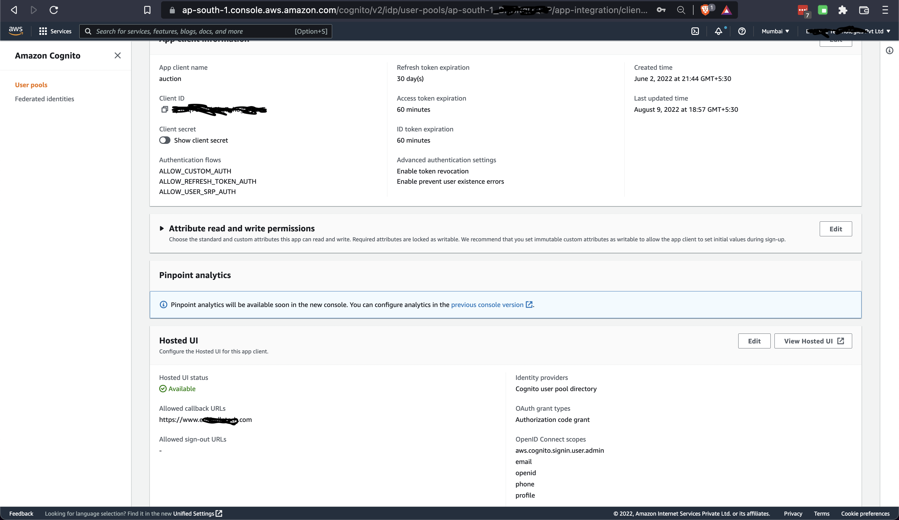
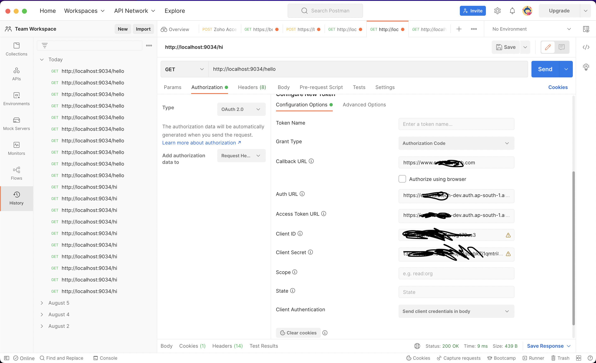
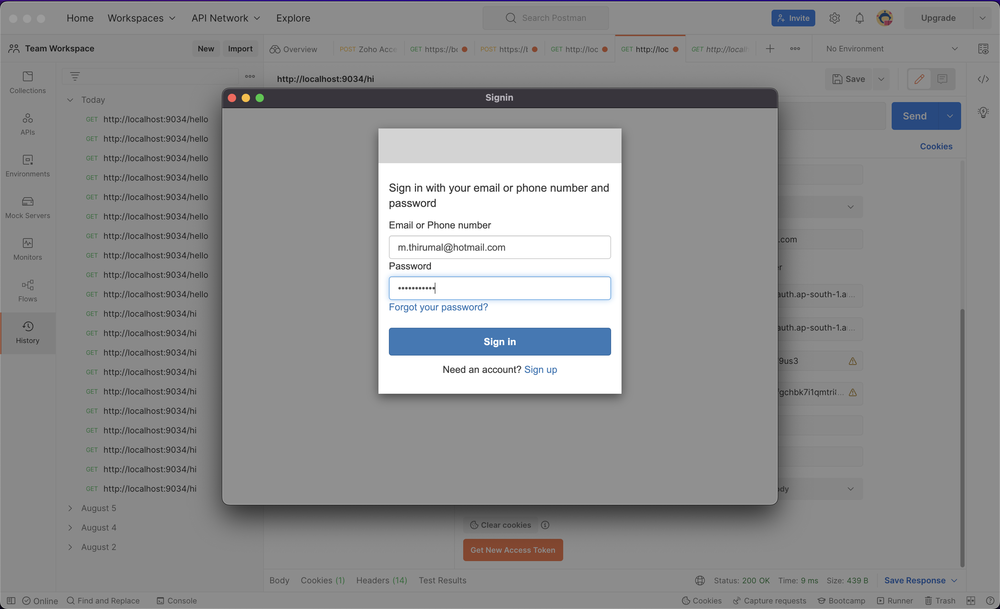
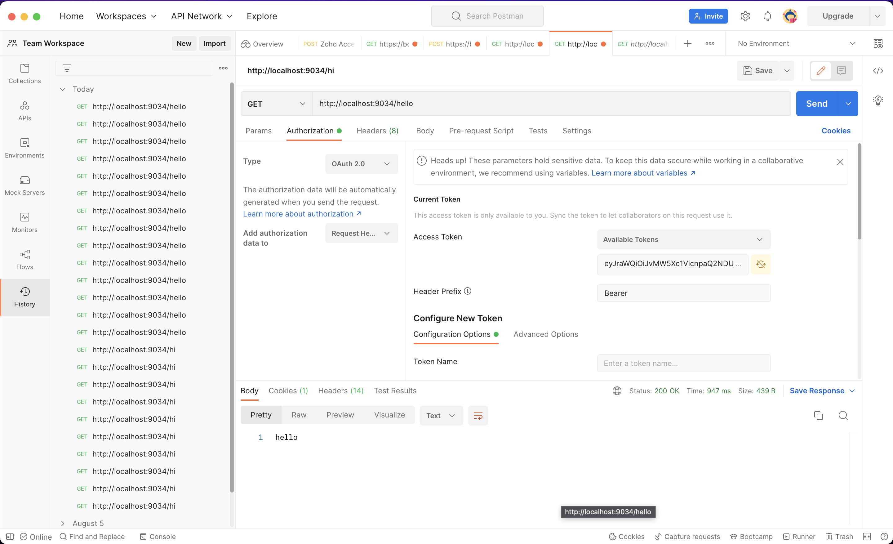

= AWS Cognito Resource Server

Securing Spring boot REST API endpoints with `Amazon Cognito` with OAuth2

AWS Cognito -> Authorization server

Spring boot -> Resource server 

== Set up Cognito User Pool

* Create AWS Cognito User Pool

* In the Configure `sign-in` experience step, check User name, Email and Allow users to sign in with a preferred user name options then click on Next.

* In the Configure security requirements step, leave all the default options except MFA enforcement where you should choose No MFA instead of Require MFA - Recommended, then click on Next.

* Step 3 : Configure `sign-up experience`, leave all default options and click on Next.

* Step 4: Configure message delivery, choose Send email with Cognito for Email provider and leave all other default options then click on Next.

* Step 5: Integrate your app, provide the `User pool name` & `App client name`, leave other default options and click Next

* Step 6: Review and click on Create User Pool.

image:doc/img/cognito%20domain.png[cognito domain, 1200, 800]

* In the details page of the created user pool, click on `App Integration` tab -> Actions -> `Create Cognito Domain` and provide the domain name then click Create Cognito Domain.

* Again, in the App Integration tab, navigate to the App client list section and click on `app` to preview its details.

* In the App client details, scroll down to the Pinpoint analytics section and click on Edit, the Edit Hosted UI page will open

* In the Edit Hosted UI page, provide the Allowed callback URLs : `https://example.com`, check Cognito user pool in the Identity providers section, check all OpenID Connect scopes options then click Save changes.

* Back to the App client details, the Pinpoint analytics section should look like the above image:

== Test the Rest API

We will use Postman to test our Rest API.

* Signup user into the Amazon Cognito

* Open Postman and provide values from Amazon Cognito User provider settings:

[cols="1,1,1"]
|===
|Attribute Key | Value | Remarks
|Callback URL | https://www.thirumal.com | Make sure to provide the exact callback URL you set in the Cognito
|Auth URL | https://xxxxx.auth.ap-south-1.amazoncognito.com/login | append `/login`
|Access Token URL | https://xxxxx.auth.ap-south-1.amazoncognito.com/oauth2/token | append /oauth2/token
|Client ID | App client id | Copy it from Cognito user pool app
|===

* Then click on Get New Access Token at the bottom, the Sign-in screen will open, click on Sign up link at the bottom the get the signup screen as follow:

* Now, run the Spring boot app and send the request with the generated `access token`

